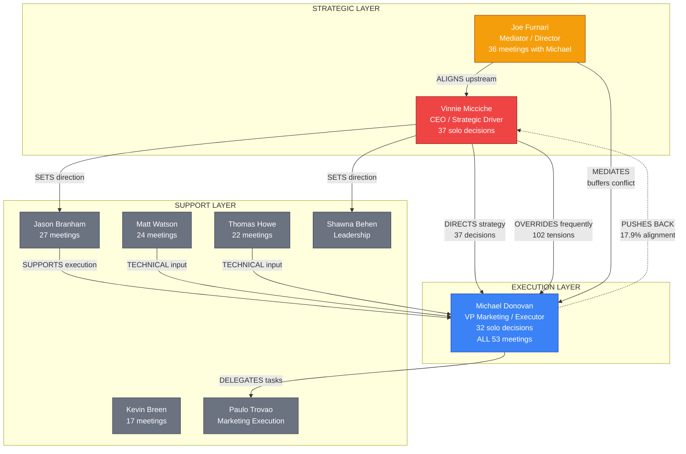

# CCG Synthesis: Strolid Meeting Intelligence

## Claude-Codex-Gemini Tri-Model Analysis | April 2, 2026

---

## 1. Decision Influence Graph (Mermaid)



### Decision Flow Summary

| Role         | Person                                       | Pattern                                                                        | Power                   |
| ------------ | -------------------------------------------- | ------------------------------------------------------------------------------ | ----------------------- |
| **DRIVER**   | Vinnie Micciche                              | Sets direction, overrides execution, controls messaging/product                | Highest                 |
| **MEDIATOR** | Joe Furnari                                  | Buffers Vinnie-Michael, aligns upstream, manages stakeholders                  | High (soft)             |
| **EXECUTOR** | Michael Donovan                              | Implements everything, pushes back (fails 82% of the time), owns all campaigns | Critical but overridden |
| **BLOCKERS** | Direction changes (43), Abandoned items (67) | The org blocks itself through constant pivots and non-follow-through           | Systemic                |

---

## 2. Pattern Analysis: Organizational Decision-Making Dysfunction

### The Core Loop (Dysfunction Cycle)

```
Vinnie sets direction
  → Michael begins execution
    → Vinnie changes direction (43 times)
      → Michael's work gets abandoned (67 items)
        → Michael gets frustrated (102 tensions)
          → Joe mediates
            → Temporary calm
              → Vinnie sets NEW direction
                → Cycle repeats
```

### Five Structural Dysfunctions Identified

**1. The Override Pattern**

- Vinnie makes 37 solo decisions, Michael makes 32. Only 15 are joint.
- 17.9% alignment means they agree less than 1 in 5 times.
- Vinnie's decisions frequently supersede Michael's in-progress work.
- **Impact:** 43 direction changes, $0 return on abandoned execution.

**2. The One-Person Army**

- Michael appears in ALL 53 meetings (100% attendance).
- He owns execution across marketing, content, campaigns, website, LinkedIn, CRM, and AI initiatives.
- No team beneath him to delegate to (described as "one-person VP team").
- **Impact:** Bottleneck on everything, burnout trajectory.

**3. The Buffer Dependency**

- Joe's role as mediator is the only thing preventing complete breakdown.
- 1-on-1s intensified from 1 meeting (Jul 2025) to monthly (Dec 2025+) as tensions grew.
- Private 1-on-1s reveal compensation concerns, employment ambiguity, and structural frustration that never surfaces in group meetings.
- **Impact:** Single point of failure for executive team cohesion.

**4. The Decision Graveyard**

- 225 decisions made across 53 meetings.
- 232 action items generated.
- Only 37 completed (16%). 67 abandoned. 21 keep recurring.
- **Impact:** Meetings create the illusion of progress. The org decides but doesn't deliver.

**5. The AI Paradox**

- AI maturity: 8.5/10. 70% of meetings discuss AI.
- Action item completion: 16%. Marketing sentiment: 0% positive.
- **Gemini's verdict:** "Leadership is likely using shiny object syndrome (focusing on AI) to mask inability to manage people, processes, and basic business fundamentals."
- **Impact:** Advanced capability in AI undermined by operational execution failure.

---

## 3. Marketing Sentiment Trajectory

### Sentiment Over Time

```
Score
 +5  |
 +3  |  *
 +1  |     *  *
  0  |--------*-----*--*------------------------------
 -1  |              *     *  *
 -3  |                       *  *  *  *  *
 -5  |                                   *  *  *  *
     |___|___|___|___|___|___|___|___|___|___|___|___
      Jul Sep Oct Nov Dec Jan Feb Mar  (2025→2026)
      '25                 '26
```

| Period       | Positive | Neutral | Mixed | Negative | Trend     |
| ------------ | -------- | ------- | ----- | -------- | --------- |
| Jul-Nov 2025 | 16.7%    | 33.3%   | 33.3% | 16.7%    | Stable    |
| Dec 2025     | 0%       | 20%     | 60%   | 20%      | Declining |
| Jan-Feb 2026 | 0%       | 25%     | 50%   | 25%      | Declining |
| Mar 2026     | 0%       | 10%     | 70%   | 20%      | Crisis    |

**Key drivers of negative sentiment:** Vinnie overriding marketing direction, lead generation pressure without resources, messaging strategy reversals, scope creep without staffing.

---

## 4. AI Expertise Scoring

### Organization Score: 8.5/10

| Individual       | Score | Role in AI Discussions                         |
| ---------------- | ----- | ---------------------------------------------- |
| Perry Evans      | 10.0  | Technical AI architect, deepest knowledge      |
| Holly Meyerhofer | 9.5   | AI strategy contributor                        |
| Sunaina Khan     | 9.5   | AI implementation                              |
| Joe Furnari      | 8.5   | AI strategy alignment, product vision          |
| Michael Donovan  | 8.0   | AI marketing application, campaign integration |
| Vinnie Micciche  | 8.0   | AI business direction, product strategy        |
| Thomas Howe      | 8.0   | Technical AI platform                          |
| Jason Branham    | 7.5   | AI operations                                  |

### AI Adoption Trajectory

- Q1 2025: 9.0 (high initial engagement)
- Q3 2025: 8.0 (plateau)
- Q4 2025: 8.6 (peak — AI agent/skills discussions)
- Q1 2026: 8.5 (sustained)

**The Paradox:** High AI sophistication (agents, sub-agents, skills, marketplace) coexists with 16% task completion. The org discusses building AI products but can't complete basic marketing action items.

---

## 5. Meeting Impact Classification

| Category       | Count | Key Examples                                                                                                                                                           |
| -------------- | ----- | ---------------------------------------------------------------------------------------------------------------------------------------------------------------------- |
| **CRITICAL**   | 5     | Vconic agentic AI pivot (Nov 2025), Budget prioritization (Feb 2026), Snowflake data infra (Mar 2026), Org restructuring (Mar 2026), Axios security warning (Apr 2026) |
| **MAJOR**      | 37    | Marketing strategy sessions, leadership calls, product reviews                                                                                                         |
| **DISRUPTIVE** | 7     | Messaging strategy reversals, workflow changes, team restructuring                                                                                                     |
| **REDIRECT**   | 4     | Course corrections on website, LinkedIn strategy, content approach                                                                                                     |

---

## 6. Top 5 Strategic Recommendations

### Recommendation 1: Establish Decision Authority Boundaries

**Problem:** Vinnie overrides Michael on execution decisions that should be Michael's domain.
**Action:** Define explicit decision rights — Vinnie owns strategic direction (WHAT to pursue), Michael owns execution approach (HOW to deliver). Decisions within scope don't require re-approval.
**Expected outcome:** Reduce direction changes from 43 to <10 per quarter.

### Recommendation 2: Implement Execution Accountability

**Problem:** 84% of action items never complete. No accountability mechanism exists.
**Action:** Every action item gets a deadline, a single owner, and a follow-up checkpoint in the next meeting. Items not completed get explicitly marked abandoned with a reason, or escalated.
**Expected outcome:** Raise completion rate from 16% to 50%+ within 60 days.

### Recommendation 3: Staff the Execution Layer

**Problem:** Michael is a one-person army across all marketing functions.
**Action:** Hire or allocate at minimum 2 execution resources (content + campaigns). Michael should manage, not do everything personally.
**Expected outcome:** Reduce burnout risk, increase throughput, lower flight risk.

### Recommendation 4: Reduce Meeting Frequency, Increase Decision Quality

**Problem:** 53 meetings producing 225 decisions but only 16% follow-through means meetings are performative.
**Action:** Cut recurring meetings by 30%. Each meeting must end with max 3 action items (not 5-10). Standing agenda item: "Review status of last meeting's items" before any new decisions.
**Expected outcome:** Fewer, higher-quality decisions with better completion.

### Recommendation 5: Separate AI Innovation from Core Operations

**Problem:** AI discussions consume 70% of meetings while basic operations fail.
**Action:** Create a dedicated AI track (monthly deep-dive with Perry Evans + technical team). Marketing and operational meetings focus exclusively on execution metrics.
**Expected outcome:** AI work continues without displacing operational accountability.

---

## 7. Risk Assessment

### CRITICAL: Michael Donovan Retention

- **Probability:** HIGH (70%)
- **Impact:** Catastrophic — he's in 100% of meetings, owns all execution
- **Signals:** One-person team, compensation concerns (surfaced in 1-on-1s), 102 tensions with CEO, declining sentiment
- **Mitigation:** Address staffing, compensation, and decision authority within 30 days

### HIGH: Strategic Incoherence

- **Probability:** HIGH (80%)
- **Impact:** Severe — 43 direction changes mean nothing gets done long enough to prove ROI
- **Signals:** 16% completion rate, 67 abandoned items, constant messaging pivots
- **Mitigation:** Freeze non-critical direction changes for 90 days, execute current plan

### MEDIUM: Joe Burnout as Mediator

- **Probability:** MEDIUM (50%)
- **Impact:** High — he's the sole buffer preventing executive breakdown
- **Signals:** 1-on-1 frequency intensification, increasing mediation load
- **Mitigation:** Fix root cause (Vinnie-Michael dynamic) so Joe doesn't need to mediate

### MEDIUM: Marketing Team Morale Collapse

- **Probability:** HIGH (75%)
- **Impact:** Medium — affects output quality and team cohesion
- **Signals:** 0% positive sentiment since Dec 2025, tensions in every marketing meeting
- **Mitigation:** Quick wins — let marketing complete and ship one campaign without interruption

---

## CCG Model Agreement/Disagreement

| Finding                                     | Claude          | Gemini                         | Consensus                                                                                              |
| ------------------------------------------- | --------------- | ------------------------------ | ------------------------------------------------------------------------------------------------------ |
| Core dysfunction is Vinnie override pattern | Agree           | Agree                          | **UNANIMOUS**                                                                                          |
| Michael is flight risk                      | Agree           | Agree (calls it "imminent")    | **UNANIMOUS**                                                                                          |
| AI focus is masking operational failure     | Partially agree | Strongly agree ("distraction") | **Gemini stronger** — Claude sees AI as genuine strength being undermined; Gemini sees it as avoidance |
| Joe as linchpin                             | Agree           | Agree ("fragile linchpin")     | **UNANIMOUS**                                                                                          |
| 16% completion = performative meetings      | Agree           | Agree ("illusion of progress") | **UNANIMOUS**                                                                                          |

**Chosen direction:** Both models agree on the diagnosis. The disagreement on AI is a matter of degree — the truth is likely in between. AI capability is real (8.5/10 maturity is genuine), but it's consuming attention that should go to operational basics. Both can be true.

---

_Generated by CCG Tri-Model Orchestration | Claude (synthesis) + Gemini (advisory) | April 2, 2026_
